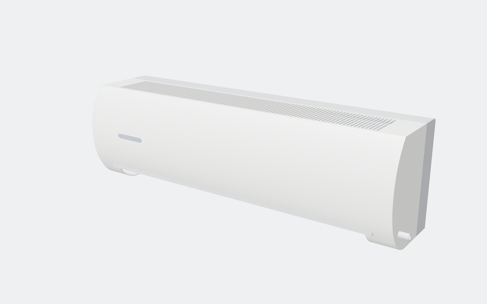
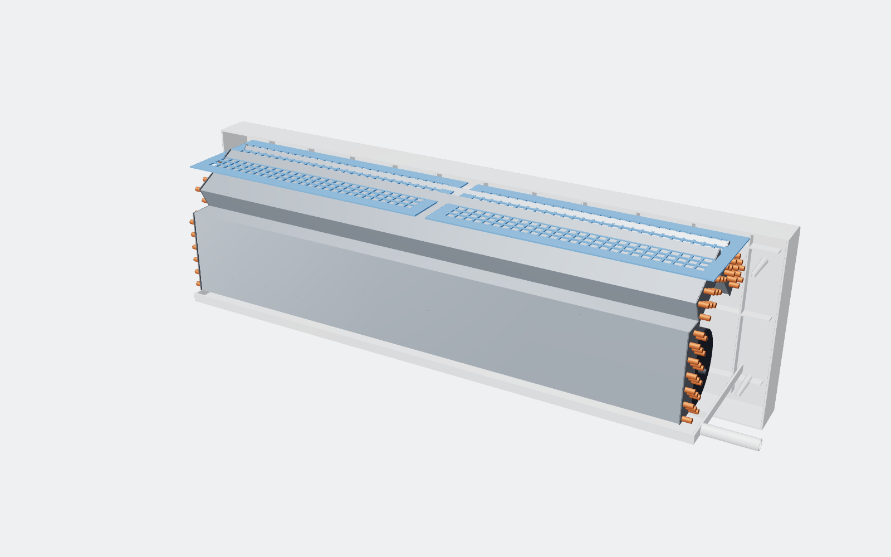
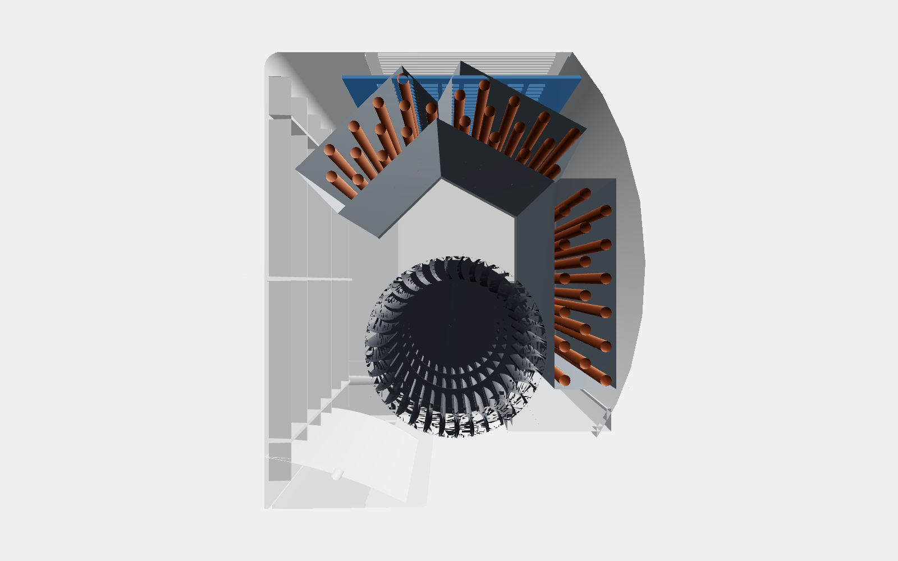
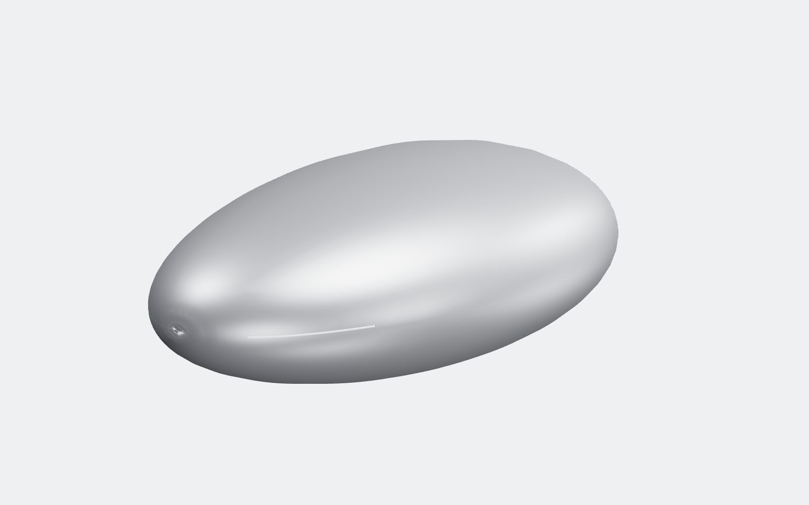

# AERO-1: high-efficiency wall-mounted AC (indoor unit)

This is a concept-stage industrial design. The model is parametric CAD written in code with CadQuery/OpenCascade.
It exports real STEP files that a manufacturer or coil vendor can open in SolidWorks, Fusion or Creo.

| Hero | Internals | Cross-section |
|---|---|---|
|  |  |  |

## Physics reality check: "10 million times more efficient"

An air conditioner doesn't create cold. It **pumps heat** from inside to outside. Its efficiency (COP = heat moved ÷
electricity used) has a hard ceiling set by the second law of thermodynamics, the Carnot limit:

```
COP_max = T_inside / (T_outside − T_inside)      (temperatures in kelvin)
```

| Case | COP |
|---|---|
| Typical installed AC today | ~3–4 |
| Best inverter mini-splits (part load) | ~6–10 |
| Carnot ceiling, refrigerant at 12 °C / 45 °C (normal coils) | 8.6 |
| Carnot ceiling, refrigerant at 17 °C / 40 °C (very large coils) | 12.6 |
| **Absolute ceiling**: room 27 °C, outdoors 35 °C, perfect machine | **37.5** |
| "10 million ×" | ~35,000,000 (impossible) |

So the realistic prize is about **2–3× today's average unit**, and theoretically at most about 10×. A heat pump cannot do better
than that. To beat it you have to change the problem instead:
- reduce the heat load (insulation, shading)
- reject heat to the night sky (radiative cooling)
- handle humidity separately (desiccants)

## How AERO-1 chases the limit

The whole design shrinks the **temperature lift** the compressor has to fight:

1. **Oversized 3-slab, 3-row A-coil** wrapped around the fan. A large face area means low air velocity and a
   smaller approach ΔT, so the evaporator can run warmer (target 15–17 °C instead of ~10 °C).
2. **Ø112 mm cross-flow fan at low rpm** with a 48 V BLDC/EC motor. Fan power scales with rpm³.
3. **Variable-speed compressor in the outdoor unit** (not modeled yet). It runs at part load almost all the time,
   which is where COP is highest.
4. **Target rating:** SEER2 ≥ 30 class. This is a *target*. It needs coil simulation and calorimeter testing to confirm.

## Repo layout

```
cad/ac_unit.py        parametric model; every dimension is a named constant at the top
out/step/*.step       one STEP per part (for tooling quotes / vendors)
out/AERO-1_assembly.step / .glb   full colored assembly
out/stl/*.stl         for 3D-printed prototypes
docs/BOM.csv          bill of materials: material, process, finish, make/buy
renders/              generated views
tools/                headless render rig (three.js + Chromium)
```

Second product: **SWEEP-1** waterless solar row cleaning robot — see [docs/SWEEP-1.md](docs/SWEEP-1.md).

Third product: **OVO-1** sealed, water-cooled local-LLM appliance: a long, low aluminium egg lying on its side with a water-jacketed skin and a hidden belly radiator (128 GB Strix Halo) — see [docs/OVO-1.md](docs/OVO-1.md).



Regenerate everything:
```
pip install cadquery
python3 cad/ac_unit.py
PW=$(npm root -g)/playwright node tools/render.mjs
```

## Status: what's done vs. what production still needs

**Done in this revision**
- [x] Envelope, molded front cover and rear chassis
  - [x] 2.5 mm walls and 1.5° draft
  - [x] snap tabs, M4 bosses, ribs
  - [x] integrated drain pan with spout, wall-plate hooks
- [x] Heat exchanger layout and tube pattern, fan and motor, louver, filters, wall plate
- [x] Per-part STEP files and BOM

**Still needed before release to manufacturing**
- [ ] Coil circuiting and capacity simulation (e.g. CoilDesigner) with the coil vendor
- [ ] Fan-scroll and stabilizer geometry, tuned with CFD
- [ ] Outdoor unit: compressor, condenser, EEV, refrigerant charge (R32 or R290)
- [ ] Control PCB, wiring harness, display
- [ ] 2D drawings with GD&T for the molded parts; tooling DFM review with the molder
- [ ] Safety certification: UL 60335-2-40 / IEC 60335-2-40 (critical for flammable R290/R32)
- [ ] Prototype build and calorimeter test (AHRI 210/240)
