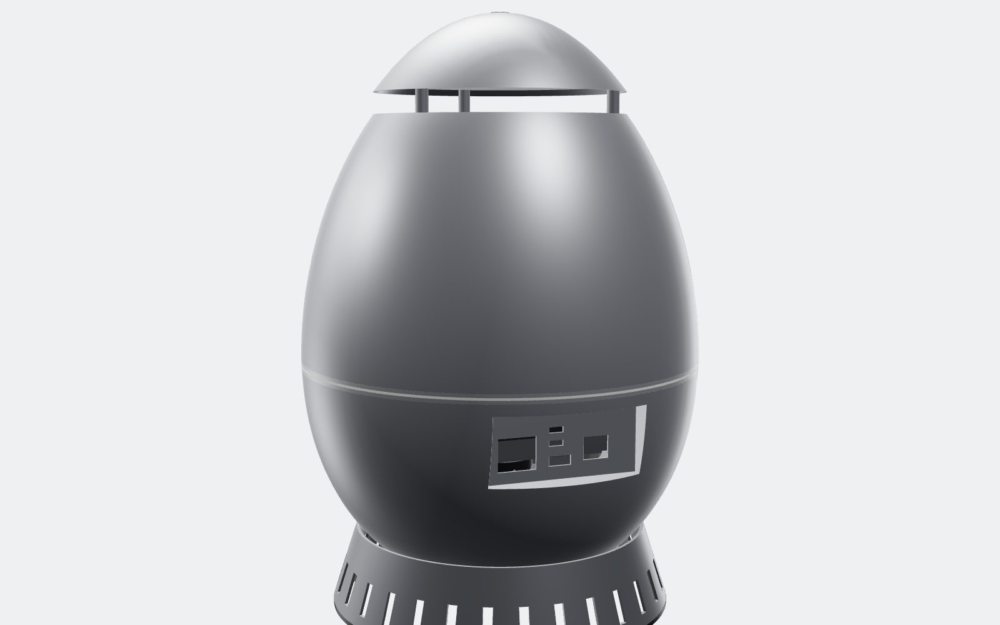

# OVO-1: egg-shaped local-LLM appliance (hardware)

| Hero | Rear ports | Section (chimney) | Exploded |
|---|---|---|---|
|  |  |  |  |

A quiet desk object that runs large language models fully offline. It is a spun-aluminium egg on a stainless steel
egg cup, 260 mm wide and 386 mm tall, about 4.5–5 kg with the electronics in. This revision is **hardware only**.
The software stack comes next (see the end of this page).

## Envelope

| | |
|---|---|
| Shape | Hügelschäffer egg. Fat end down, 360 mm tip to tip, Ø260 mm, widest point 25 mm below mid-height |
| Overall | Ø260 × 386 mm, including the stand and the floating crown |
| Shell | 2.0 mm 5052-H32 aluminium, metal-spun in two halves. Bead-blast, then clear anodize |
| Equator band | Polished 316 stainless ring, 6 mm tall, with an opal light-ring groove |
| Stand | Spun 304 stainless egg cup with 30 intake slots and a silicone foot ring |
| Internal frame | 1.5 mm deck and 2 mm spine, laser-cut 304 stainless, spot-welded |
| Metal enclosure mass | 2.7 kg (from CAD volumes) |

**Why the seam is at the equator.** Both shell halves have their widest diameter at the open edge. Each one can be spun
over a solid mandrel and slid off it. The same seam is the service split: the upper shell twists off three bayonet lugs.

## Compute: why Strix Halo

For a local LLM the bottleneck is **memory size and memory bandwidth**, not FLOPs. Each generated token streams every
active weight through memory once. So:

```
tokens/s  ≈  effective memory bandwidth  ÷  bytes of active weights per token
```

| Option | Memory for the model | Bandwidth | Power | Fits an egg? |
|---|---|---|---|---|
| **AMD Ryzen AI Max+ 395 (Strix Halo), Mini-ITX, 128 GB** | up to ~96 GB as GPU memory | 256 GB/s | 120 W sustained | **Yes, chosen** |
| NVIDIA GB10 (DGX Spark class), 128 GB | ~120 GB | 273 GB/s | ~140 W | Not sold as a bare board |
| RTX 5090 desktop | 32 GB | 1.8 TB/s | 575 W GPU alone | No: too hot, too little memory for 70B |
| Apple M-series Ultra | up to 512 GB | ~800 GB/s | ~200 W | No: not available as a module |

Strix Halo is the only 128 GB unified-memory part sold as a standard Mini-ITX board (for example the Framework Desktop
mainboard). It drops straight onto the spine's Mini-ITX hole pattern.

**Expected speed.** These are bandwidth-bound estimates at ~75% of 256 GB/s, Q4 weights, single user. They are not measured.

| Model | Active weights | ≈ tokens/s |
|---|---|---|
| Llama 3.3 70B (dense) | ~42 GB | 4–5 |
| Qwen3 32B (dense) | ~20 GB | 9–10 |
| gpt-oss-120b (MoE, ~5B active) | ~3 GB/token | 35–50 |
| Qwen3 30B-A3B (MoE) | ~2 GB/token | 60–80 |

Mixture-of-experts models are the sweet spot. They need the 128 GB to *hold* the model, but read only a few GB per token.

## Internal layout


The whole core hangs from the stainless **deck**, which screws to three bosses in the lower shell. Lift the upper shell
off, remove three screws, and the core comes out in one piece.

From bottom to top:

1. **Filter.** A stainless mesh disc, magnet-held at the intake rim. It drops out of the bottom for washing.
2. **Fan.** 140 × 25 mm (Noctua NF-A14 class), horizontal, under the deck. It pushes air up.
3. **Board.** Mini-ITX, mounted *vertically* on the spine with 6 mm standoffs, I/O edge down. The LPDDR5X is
   soldered around the SoC, so nothing tall sticks out of the board.
4. **Heatsink.** A copper vapour-chamber base with 24 vertical aluminium fins, 120 × 110 × 53 mm. A 0.8 mm
   aluminium baffle closes the fin channels, so fan air *has* to go through the fins.
5. **PSU.** 300 W open-frame 12 V (Mean Well EPP-300-12 class), on the back of the spine, in the same airflow.
6. **Ports.** A flat stainless panel recessed into the rear of the lower shell:
   - IEC C14 mains inlet
   - 2 × USB4 (USB-C)
   - 1 × USB-A
   - 1 × 5GbE RJ45

   Short panel-mount extension leads run from the board's I/O edge to this panel.
7. **Crown.** The tip of the egg, held 14 mm above the shell on three posts. The gap forms the annular exhaust slot.
   A capacitive touch pad under the crown is the power button.
8. **Light ring.** An opal light pipe in the equator band. It shows status, and while the model is generating it
   pulses at a brightness that follows tokens/s.

`cad/llm_egg.py` runs an **interference check** on every build. Every vertex of every internal part must sit at least
3 mm inside the shell's inner surface, or the build fails. Current tightest gap: deck rim, 3.7 mm.

## Thermals: chimney cooling


Air enters through the cup slots and the bottom filter. The fan pushes it up through the heatsink fins and past the PSU.
It leaves through the slot under the crown. Hot air rises anyway, so buoyancy helps the fan instead of fighting it.

**Power budget (sustained generation)**

| Load | W (DC) |
|---|---|
| SoC (CPU + GPU + memory controller), cTDP | 120 |
| Board, 5GbE, NVMe, USB | 20 |
| Fan, light ring, touch | 3 |
| **DC total** | **≈ 143** |
| PSU loss at ~50% load (~92% efficient) | 12 |
| **Heat into the air / from the wall** | **≈ 155** |

The airflow needed for a 12 K air temperature rise is:

```
Q = P / (ρ·cp·ΔT) = 155 / (1.2 × 1005 × 12) ≈ 0.011 m³/s ≈ 23 CFM
```

A 140 mm fan moves that at roughly 800–1000 rpm against this duct's restriction. The free areas are:

| Opening | Free area |
|---|---|
| Intake (bottom opening) | ~190 cm² |
| Exhaust slot (Ø162 × 14 mm) | ~71 cm² |
| Fan | ~120 cm² |

At 23 CFM, air leaves the exhaust slot at ~1.6 m/s, which is quiet. The aluminium shell also spreads heat and gives
some of it off from its ~0.25 m² surface.

**Targets (to be confirmed on a prototype):**
- under 25 dBA at 1 m at idle
- under 32 dBA at 1 m during sustained generation
- shell surface under 45 °C

## Cost (rough, ~1k units, not yet quoted)

| Item | USD |
|---|---|
| Strix Halo Mini-ITX board, 128 GB | 1,700–2,000 |
| NVMe SSD, 2 TB | 150 |
| 300 W PSU, fan, filter | 75 |
| Vapour-chamber heatsink and baffle (custom) | 45 |
| Spun aluminium shells (2) and crown, anodized | 110 |
| Stainless band, stand, deck and spine | 80 |
| Port panel, extension leads, light ring, touch PCB, harness | 60 |
| Assembly and test | 40 |
| **Total** | **≈ $2.3–2.6k** |

The board is ~75% of the cost. The enclosure is ~$250.

## Risks and open items before a prototype

1. **Board power input.** Confirm the chosen board's input (24-pin ATX vs 12 V DC). If it needs ATX, add a 12 V→ATX
   DC converter (picoPSU class). There is room for one behind the spine.
2. **EMI.** The metal egg is a good shield, but the 14 mm exhaust slot and the bottom opening are long apertures. Plan:
   - fine stainless mesh in the exhaust slot (the filter already covers the intake)
   - a conductive gasket at the equator seam

   Then pre-scan for FCC Part 15 B / EN 55032.
3. **Electrical safety (IEC 62368-1).** Every metal part must be bonded to protective earth:
   - both shells, the band, the crown and the stand
   - with straps across the bayonet seam and the crown posts

   The mains inlet and PSU need creepage checks against the stainless deck.
4. **Thermal validation.** Run a CFD pass on the chimney, then a thermocouple prototype at 120 W sustained. If the
   exhaust slot proves too restrictive, raise `CROWN_LIFT` (it is a parameter).
5. **Stability.** The centre of mass is low (fan, PSU, deck and stand are all in the bottom third). Still, check the
   tip-over angle with the cables attached.

## Next: software (not in this revision)

- Linux with ROCm
- llama.cpp / vLLM serving an OpenAI-compatible API on the LAN
- mDNS discovery (`ovo.local`)
- a tiny daemon that drives the light ring from the generation rate

## Files

- `cad/llm_egg.py`: parametric model. Egg size, shell thickness, seam height, crown lift and board position are all
  parameters at the top. The build runs the interference check.
- `out/ovo1/step/*.step`: one STEP per part.
- `out/ovo1/OVO-1_assembly.step` / `.glb`: full colored assembly. `OVO-1_exploded.glb`: exploded view.
- `out/ovo1/stl/*.stl`: files for 3D-printed fit-check prototypes.
- `docs/OVO-1_BOM.csv`: bill of materials.
- Renders: `SET=ovo1 PW=$(npm root -g)/playwright node tools/render.mjs`
