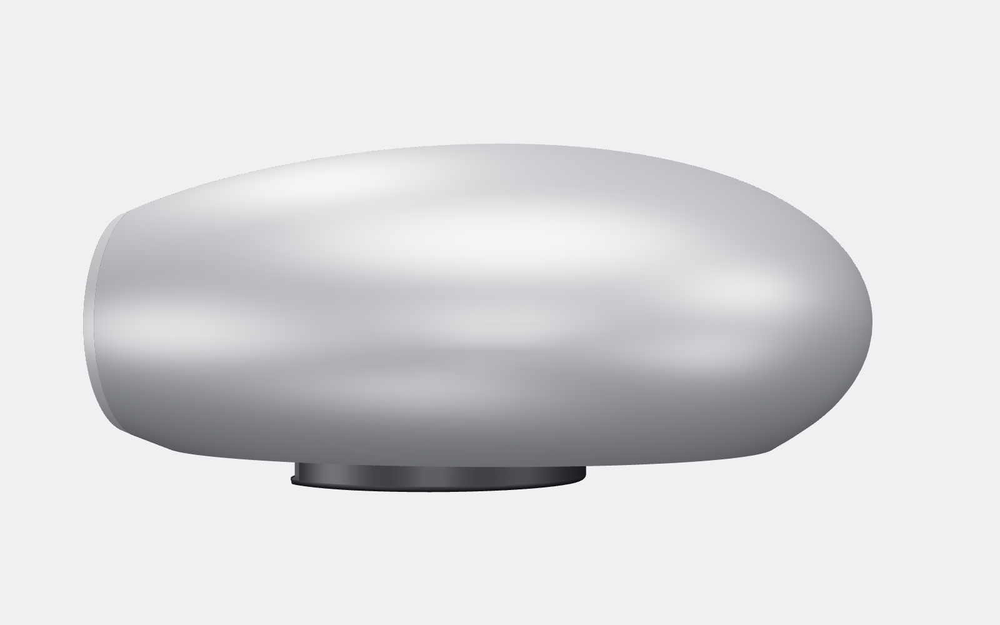
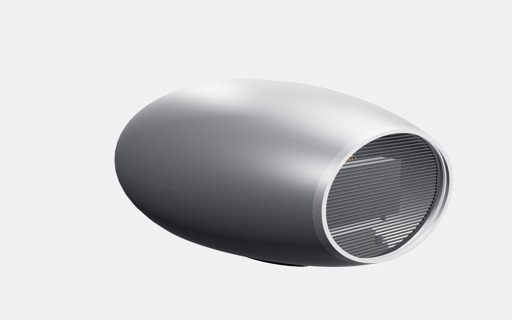
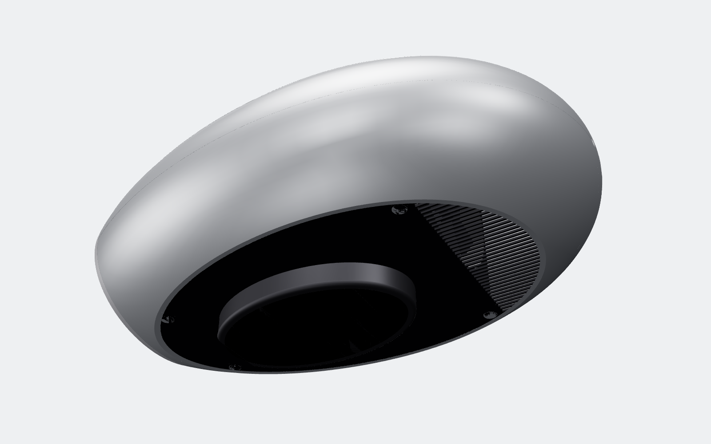
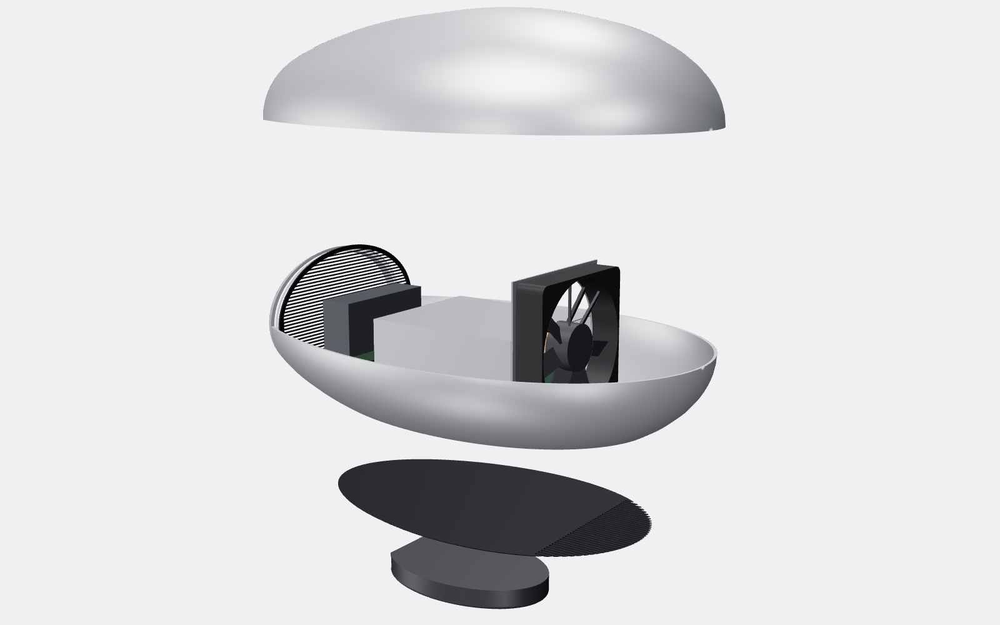
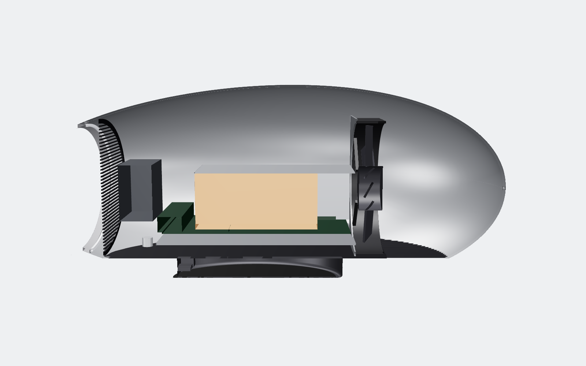
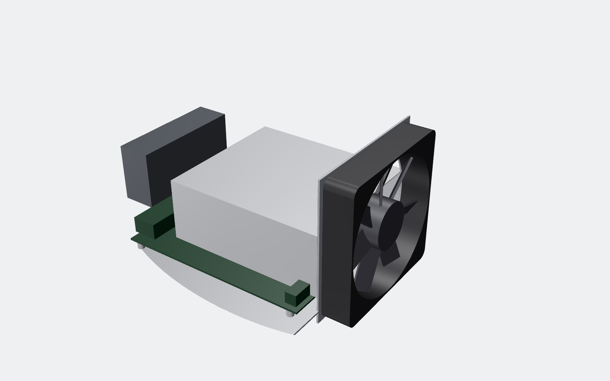

# OVO-1: local-LLM appliance, an egg lying on its side (hardware)


| Profile | Tail (the only visible function) | Underside | Exploded |
|---|---|---|---|
|  |  |  |  |

A quiet desk object that runs large language models fully offline. It is an aluminium egg lying on its side, flattened
into a low oval like a pebble or a small spacecraft. It floats 18 mm above the desk on a hidden stainless plinth.

- 440 mm long, 270 mm wide, 174 mm tall
- about 6 kg with the electronics in
- this revision is **hardware only**; the software stack comes next (see the end of this page)

## Design intent: nothing on the surface

From above and from the sides there is only one unbroken aluminium surface and one hairline seam. There are no vents,
buttons, screws or logo cut-outs. All of the function sits where you don't look:

| Function | Where | How it stays invisible |
|---|---|---|
| Air in | Belly, under the nose | Fine slots in a dark stainless belly plate, in the body's own shadow |
| Air out | Tail | A dark louvred grille recessed 20 mm inside a polished stainless nozzle lip. It reads as a jet-engine exhaust, the one bright detail on the product |
| Status | Inside the nozzle | An opal light ring behind the lip glows softly while the model is generating |
| Ports | Back face of the plinth, under the tail overhang | IEC C7 (figure-8) mains, 2 × USB4, 5GbE. Cables leave straight back, under the body |
| Power | Button on the plinth back; wake by tapping the shell (accelerometer) | No button on the body |

The body sits on a plinth set far in from its edge, so the dark underside drops into shadow and the egg seems to hover.

## Envelope

| | |
|---|---|
| Shape | Hügelschäffer egg, 440 mm nose to tail, widest point 30 mm ahead of mid-length (blunt nose, long tail). Every cross-section is an ellipse with height/width = 0.68 |
| Overall | 440 L × 270 W × 174 H mm |
| Shell | Two halves in 5052-H32 aluminium, about 2.5 mm thick at the flanks and 1.7 mm on top. Deep-drawn, CNC-trimmed, bead-blasted, clear anodized. CNC from 6061 billet for prototypes |
| Seam | One 0.3 mm hairline at the equator |
| Tail nozzle | Polished 316 stainless lip, 6 mm deep |
| Exhaust grille | Dark PVD stainless, 39 louvres, recessed 20 mm |
| Belly plate | 1.5 mm 304 stainless, dark PVD, carries the intake slots |
| Plinth | Solid 304 stainless puck, 150 × 104 × 18 mm, 1.8 kg. It keeps the centre of mass low |
| Internal tray | 1.5 mm 304 stainless, cut to follow the shell's inner contour, with the fan bracket welded on |
| Metal enclosure mass | 4.0 kg (from CAD volumes) |

**Why the seam is at the equator.** Each half is widest at its open edge, so it can be deep-drawn over a punch and come
off it. The same seam is the service split:

1. Remove the plinth and the belly plate (four screws, hidden under the plinth).
2. Remove the four screws inside that hold the halves together.
3. Lift the upper half off.

## Compute: why Strix Halo

For a local LLM the bottleneck is **memory size and memory bandwidth**, not FLOPs. Each generated token streams every
active weight through memory once. So:

```
tokens/s  ≈  effective memory bandwidth  ÷  bytes of active weights per token
```

| Option | Memory for the model | Bandwidth | Power | Fits an egg? |
|---|---|---|---|---|
| **AMD Ryzen AI Max+ 395 (Strix Halo), Mini-ITX, 128 GB** | up to ~96 GB as GPU memory | 256 GB/s | 120 W sustained | **Yes, chosen** |
| NVIDIA GB10 (DGX Spark class), 128 GB | ~120 GB | 273 GB/s | ~140 W | Not sold as a bare board |
| RTX 5090 desktop | 32 GB | 1.8 TB/s | 575 W GPU alone | No: too hot, too little memory for 70B |
| Apple M-series Ultra | up to 512 GB | ~800 GB/s | ~200 W | No: not available as a module |

Strix Halo is the only 128 GB unified-memory part sold as a standard Mini-ITX board (for example the Framework Desktop
mainboard). It drops straight onto the tray's Mini-ITX standoffs.

**Expected speed.** These are bandwidth-bound estimates at ~75% of 256 GB/s, Q4 weights, single user. They are not measured.

| Model | Active weights | ≈ tokens/s |
|---|---|---|
| Llama 3.3 70B (dense) | ~42 GB | 4–5 |
| Qwen3 32B (dense) | ~20 GB | 9–10 |
| gpt-oss-120b (MoE, ~5B active) | ~3 GB/token | 35–50 |
| Qwen3 30B-A3B (MoE) | ~2 GB/token | 60–80 |

Mixture-of-experts models are the sweet spot. They need the 128 GB to *hold* the model, but read only a few GB per token.

## Internal layout



Air runs nose to tail in one straight line, like a jet engine:

1. **Intake grille.** 37 slots, 2.6 mm wide, in the belly plate under the nose. Open area ≈ 38 cm².
2. **Fan.** 120 × 25 mm (Noctua NF-A12x25 class), axis nose-to-tail, on a stainless bracket welded to the tray.
3. **Board.** Mini-ITX Strix Halo, lying flat on the tray. Its I/O edge faces the tail, and short panel-mount leads
   run from it down to the plinth ports.
4. **Heatsink.** A copper vapour-chamber base with 26 aluminium fins running nose to tail, 110 × 120 × 50 mm.
   A 0.8 mm aluminium shroud runs from the fan outlet over the fins, so no air bypasses them.
5. **PSU.** 300 W open-frame 12 V (Mean Well EPP-300-12 class), standing on edge behind the board. It runs at about
   50% load in the exhaust stream.
6. **Exhaust.** Recessed louvred grille, then the light ring, then the nozzle lip. Open area ≈ 105 cm².



`cad/llm_egg.py` runs an **interference check** on every build. Every vertex of every internal part must sit at least
3 mm inside the shell's elliptical inner surface, or the build fails. Current tightest gap: the tray, ≈ 4.6 mm.

## Thermals

**Power budget (sustained generation)**

| Load | W (DC) |
|---|---|
| SoC (CPU + GPU + memory controller), cTDP | 120 |
| Board, 5GbE, NVMe, USB | 20 |
| Fan, light ring | 3 |
| **DC total** | **≈ 143** |
| PSU loss at ~50% load (~92% efficient) | 12 |
| **Heat into the air / from the wall** | **≈ 155** |

The airflow needed for a 12 K air temperature rise is:

```
Q = P / (ρ·cp·ΔT) = 155 / (1.2 × 1005 × 12) ≈ 0.011 m³/s ≈ 23 CFM
```

| Opening | Open area | Air speed at 23 CFM |
|---|---|---|
| Intake slots | ≈ 38 cm² | ≈ 2.9 m/s |
| Exhaust grille | ≈ 105 cm² | ≈ 1.0 m/s |

The intake is the tightest point. Its speed is comparable to the intake of a compact desktop. The exhaust is slow and
quiet, so the outlet you can see makes almost no noise. The aluminium body also gives off some heat from its ~0.3 m²
of surface.

**Targets (to be confirmed on a prototype):**
- under 25 dBA at 1 m at idle
- under 34 dBA at 1 m during sustained generation
- top surface under 42 °C

## Cost (rough, ~1k units, not yet quoted)

| Item | USD |
|---|---|
| Strix Halo Mini-ITX board, 128 GB | 1,700–2,000 |
| NVMe SSD, 2 TB | 150 |
| 300 W PSU, 120 mm fan | 65 |
| Vapour-chamber heatsink and shroud (custom) | 45 |
| Deep-drawn aluminium shell halves, trimmed and anodized | 140 |
| Stainless nozzle, exhaust grille, belly plate, plinth, tray | 95 |
| Extension leads, light ring, LED/accelerometer PCB, harness | 50 |
| Assembly and test | 40 |
| **Total** | **≈ $2.3–2.6k** |

The board is ~75% of the cost. The enclosure is ~$280.

## Risks and open items before a prototype

1. **Board power input.** Confirm the chosen board's input (24-pin ATX vs 12 V DC). If it needs ATX, add a 12 V→ATX
   DC converter (picoPSU class). There is room for one beside the PSU.
2. **Intake restriction.** The belly grille is the tightest point (≈ 2.9 m/s). If the prototype is too loud, there are
   two fixes. First, raise `Z_CUT` a few mm, which widens the flat belly and the grille. Second, add micro-perforation
   to the lower nose of the shell. That surface faces the desk and stays out of sight.
3. **See-through tail.** At some angles the PSU is visible behind the exhaust louvres. In production, angle the louvres
   15° or add a matte-black baffle sleeve, so the tail reads as pure black.
4. **EMI.** The aluminium body is a good shield, but the tail opening is a large aperture. Plan:
   - a conductive gasket at the equator seam
   - a pre-scan for FCC Part 15 B / EN 55032
   - if needed, a fine conductive mesh behind the louvres
5. **Electrical safety (IEC 62368-1).** The figure-8 C7 inlet has no earth pin. That makes OVO-1 a Class II product,
   like a Mac mini: the PSU needs reinforced insulation between mains and all of the metal around it. The alternative
   is an earthed C5 (cloverleaf) inlet, with both shell halves, the nozzle, the belly plate and the tray bonded to
   protective earth. The C5 still fits in the 18 mm plinth. Decide this before the PSU is chosen.
6. **Forming.** The cross-section is elliptical, not round, so the shell can't be metal-spun. It needs a draw die per
   half (or hydroforming). Tooling is the main up-front cost.

## Next: software (not in this revision)

- Linux with ROCm
- llama.cpp / vLLM serving an OpenAI-compatible API on the LAN
- mDNS discovery (`ovo.local`)
- a tiny daemon that drives the tail light ring from the generation rate

## Files

- `cad/llm_egg.py`: parametric model. Length, width, flattening `K`, belly cut, tail opening and every internal position
  are parameters at the top. The build runs the interference check and prints the intake and exhaust open areas.
- `out/ovo1/step/*.step`: one STEP per part.
- `out/ovo1/OVO-1_assembly.step` / `.glb`: full colored assembly. `OVO-1_exploded.glb`: exploded view.
- `out/ovo1/stl/*.stl`: files for 3D-printed fit-check prototypes.
- `docs/OVO-1_BOM.csv`: bill of materials.
- Renders: `SET=ovo1 PW=$(npm root -g)/playwright node tools/render.mjs`
