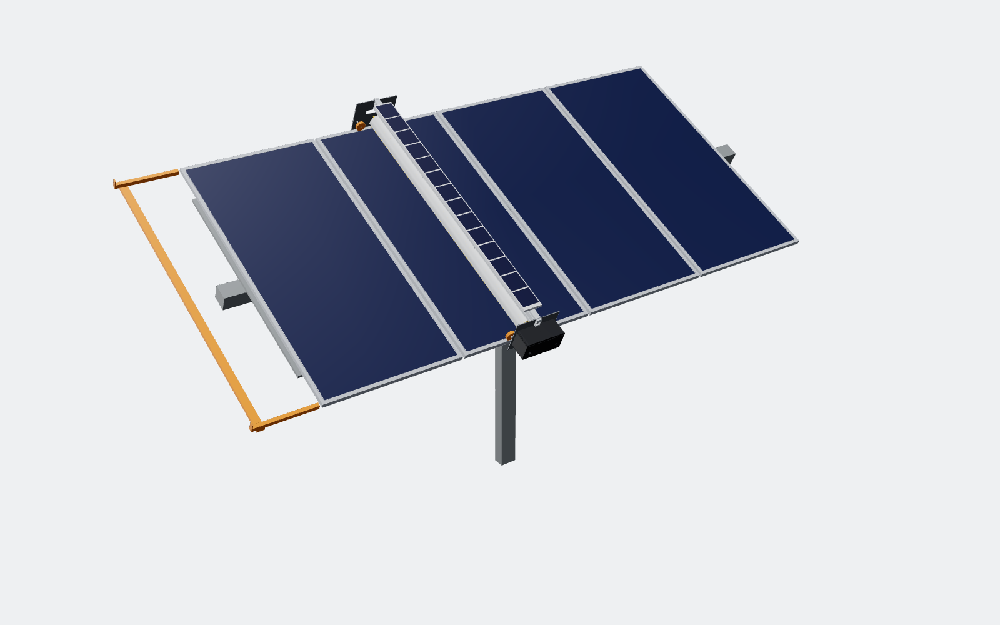

# SWEEP-1: waterless self-powered cleaning robot for solar rows

## The problem

- Dust and dirt cost **5–10% of global PV output**, about €3–5B a year
  ([Wikipedia / IEA-PVPS](https://en.wikipedia.org/wiki/Soiling_(solar_energy))).
- In deserts the loss reaches **39–50% a year** if panels aren't cleaned (Atacama, Middle East).
- Cleaning with water and crews is expensive. It's also scarce: the sunniest sites tend to be the driest.
- Robots already exist (Ecoppia), but cost **$0.03–0.06/W, i.e. $30–60k per MW**
  ([National Geographic](https://www.nationalgeographic.com/environment/article/how-to-clean-all-those-solar-panels-get-robots-to-do-it)).

**Target:** about **$12k per MW in hardware**, a quarter to a fifth of today's price, with no water and no crew.

## How it works

- One robot per row. It spans the module in portrait (2,382 mm) and rides the **top and bottom frame lips** on PU-tread wheels.
  - Side guide rollers bear on the frame outer faces, so the robot can't walk off the row.
- Every night it drives the row once. A Ø130 mm rotating microfiber/nylon brush sweeps dust **downslope** off the glass.
- In the day it parks on a **dock** at the row end, off the array, so it never shades a panel.
- A 40 W PV strip on the spine charges a 24 V 10 Ah LiFePO4 pack. The robot needs no wiring, trenching or water line.
- Short bridge rails carry it across the gaps between tracker tables.

## The core design decision: one motor, one line shaft

A robot that spans 2.4 m and drives from both ends tends to **rack**: one end runs ahead, the robot skews, and it jams or
falls off. Competitors solve this with two motors plus sync electronics and sensors.

SWEEP-1 uses **one gearmotor and one Ø25 mm aluminium line shaft** that carries the drive wheel at *both* ends. The ends
are mechanically locked together, so racking can't happen. That removes:
- a motor
- a motor driver
- the encoders
- the sync firmware

Two mid-span bearing hangers bolted to the spine stop the shaft whipping.

## Cost (rough, at volume, not yet quoted)

| Item | USD |
|---|---|
| Spine extrusion, end plates, hood, shaft, bearings | 115 |
| Wheels, guide rollers | 40 |
| Brush cartridge (wear part) | 60 |
| Drive and brush BLDC motors | 80 |
| LiFePO4 pack, 40 W PV strip | 85 |
| Controller, MPPT, LoRa, IMU, end sensors | 55 |
| Enclosure, harness, fasteners | 40 |
| Assembly and test | 40 |
| **Robot total** | **≈ $490** |

At a 54 kW row (90 × 600 W modules), 1 MW needs ≈ 18.5 robots. Including docks and bridges, that's **≈ $12k per MW**.

**Payback** at $40/MWh, from energy recovered alone:
- US Southwest (≈ 5% soiling): about $4k/MW/yr, so about **3 years**.
- Middle East (≈ 15%): about $12k/MW/yr, so about **1 year**.

These figures exclude the water and crew costs that cleaning would otherwise need.

## Risks to retire before pilot

1. **Glass anti-reflective coating warranty.** Module makers approve cleaning methods. We need an abrasion test
   (brush cycles × years) and an approval letter from 2–3 module makers before any utility will sign.
2. **Wind stow and tracker angles.** The robot must lock onto its dock before high wind and at extreme tilt. Docking
   latch loads still need sizing.
3. **Things a dry brush won't remove.** Bird droppings, and dust baked on by dew, stay. Plan an optional monthly water
   pass, or a damp-brush mode.
4. **Frame variations.** Lip width and height differ between module brands. The wheel track and guide rollers need
   ±5 mm of adjustment, which the T-slot spine allows.

## Files

- `cad/solar_cleaner.py`: parametric model. Module size, tilt and brush size are all parameters at the top.
- `out/sweep1/step/*.step`: one STEP per robot part.
- `out/sweep1/SWEEP-1_on_row.step` / `.glb`: robot on a 4-module tracker table with dock and pier.
- `out/sweep1/stl/*.stl`: files for 3D-printed prototype parts.
